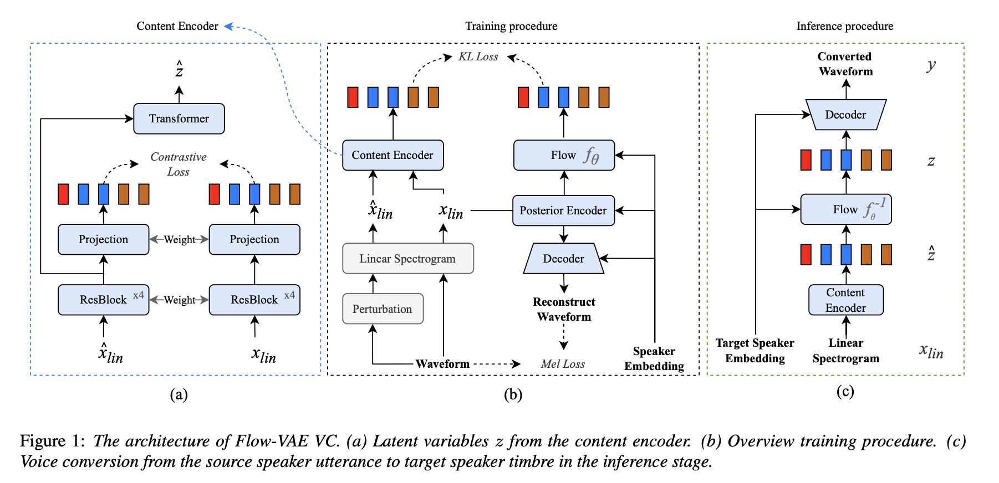

Unofficial implementation of FlowVAE

[demo & paper page](https://blog.frostmiku.com/Flow-VAE-VC/)

## Setup
1. resample the dataset sr to 16k
2. run `python 1.embedding_sid.py /path/to/dataset data/spkerEmbed` to extract sid
3. set train/val labels into the label dir, format as `wav_path|sid_path`
4. run `python train.py -m YourModelName` to trian a vc model

## VC

1. modify `configs/vc_rule.yaml`
2. run `python 2.vc /path/to/sid /path/to/output_dir`
